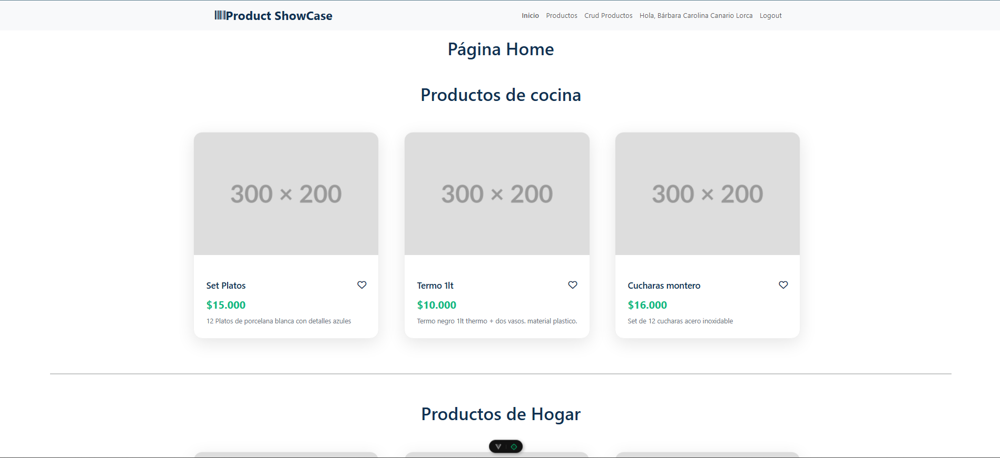
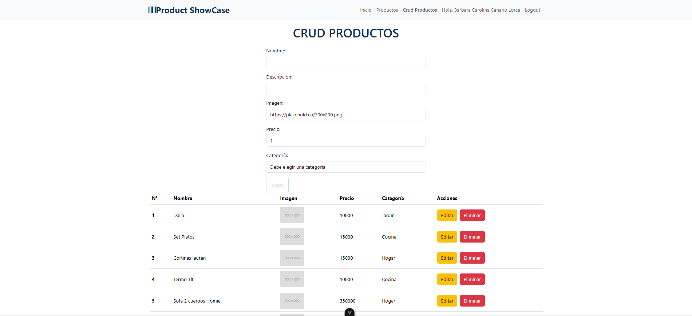
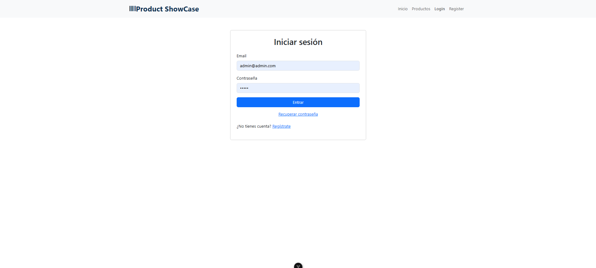
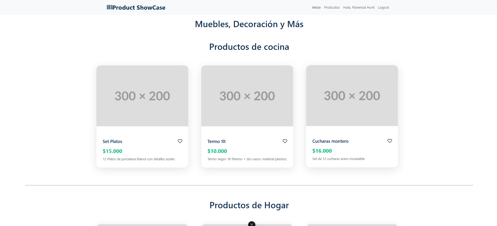

# Product Showcase
Bárbara Canario

Una aplicación web de exhibición de productos construida con Vue.js 3, que permite a los usuarios explorar productos categorizados, agregar a favoritos y gestionar autenticación de usuarios.

## Instalación

### Prerrequisitos

- Node.js (versión 16 o superior)
- npm o yarn

### Pasos de Instalación

1. Clona el repositorio:

   ```sh
   git clone <url-del-repositorio>
   cd product-showcase
   ```

2. Instala las dependencias:

   ```sh
   npm install
   ```

3. Configura Firebase:
   - Crea un proyecto en [Firebase Console](https://console.firebase.google.com/)
   - Habilita Authentication y Firestore
   - Copia las credenciales en `src/firebaseConfig.js`

4. Ejecuta la aplicación en modo desarrollo:
   ```sh
   npm run dev
   ```

## Uso

### Comandos Disponibles

- `npm run dev`: Inicia el servidor de desarrollo con hot-reload
- `npm run build`: Construye la aplicación para producción
- `npm run preview`: Previsualiza la build de producción
- `npm run test:unit`: Ejecuta pruebas unitarias con Vitest
- `npm run test:e2e:dev`: Ejecuta pruebas end-to-end con Cypress en modo desarrollo
- `npm run test:e2e`: Ejecuta pruebas end-to-end en build de producción

## Justificaciones Técnicas

### Elección de Tecnologías

#### Vue.js 3 con Composition API

- **Justificación**: Vue 3 ofrece mejor rendimiento, tree-shaking y una API más flexible con Composition API, que permite una mejor organización del código en componentes complejos. Facilita la reutilización de lógica y mejora la mantenibilidad en aplicaciones de mediano tamaño como esta.

#### Vite como Bundler

- **Justificación**: Vite proporciona un desarrollo extremadamente rápido con hot module replacement (HMR) casi instantáneo. Su configuración cero y soporte nativo para Vue hacen que sea ideal para proyectos modernos, reduciendo significativamente los tiempos de desarrollo comparado con Webpack.

#### Pinia para State Management

- **Justificación**: Pinia es el store oficial recomendado para Vue 3, más ligero y simple que Vuex. Su API intuitiva basada en Composition API se integra perfectamente con Vue 3, facilitando la gestión del estado global (productos, usuario, favoritos) sin complejidad innecesaria.

#### Firebase (Authentication y Firestore)

- **Justificación**: Firebase ofrece una solución backend-as-a-service rápida de implementar, con autenticación robusta y base de datos en tiempo real. Reduce la necesidad de un backend personalizado, ideal para prototipos y MVPs. Firestore permite consultas eficientes y sincronización automática de datos.

#### Vuetify para UI Components

- **Justificación**: Vuetify proporciona componentes Material Design preconstruidos y responsivos, acelerando el desarrollo de la interfaz. Su integración con Vue y soporte para temas facilita mantener una UI consistente y moderna sin reinventar componentes básicos.

#### Cypress para End-to-End Testing

- **Justificación**: Cypress es excelente para pruebas e2e con una API simple y debugging visual. Permite probar flujos completos de usuario (navegación, autenticación, interacciones) de manera confiable, asegurando calidad en producción.

#### Vitest para Unit Testing

- **Justificación**: Vitest es rápido y nativo para Vite, con configuración mínima. Permite pruebas unitarias eficientes de componentes y lógica, integrándose perfectamente con el entorno de desarrollo.

### Arquitectura del Proyecto

- **Estructura de Componentes**: Separación clara entre vistas (Views), componentes reutilizables (Components) y layouts. Los componentes están organizados por funcionalidad (productos, autenticación).
- **State Management**: Uso de Pinia stores para productos, usuario y contadores, centralizando la lógica de estado.
- **Routing**: Vue Router con rutas protegidas para áreas de administración.
- **Estilos**: CSS scoped para aislamiento, con variables de color consistentes (#212529 para textos principales).

### Decisiones de Diseño

- **Responsive Design**: Grid system de Vuetify para adaptabilidad móvil y desktop.
- **Favoritos**: Implementación local en memoria para simplicidad; puede extenderse a persistencia con localStorage o backend.
- **Categorización**: Filtrado dinámico de productos por categoría para mejor UX.
- **Autenticación**: Integración con Firebase para login/registro seguros.

## Tecnologías Utilizadas

- **Frontend**: Vue.js 3, Vuetify, Vue Router
- **Build Tool**: Vite
- **State Management**: Pinia
- **Backend**: Firebase (Auth, Firestore)
- **Testing**: Vitest (unit), Cypress (e2e)
- **Lenguaje**: JavaScript (ES6+)

## Contribución

1. Fork el proyecto
2. Crea una rama para tu feature (`git checkout -b feature/nueva-funcionalidad`)
3. Commit tus cambios (`git commit -am 'Agrega nueva funcionalidad'`)
4. Push a la rama (`git push origin feature/nueva-funcionalidad`)
5. Abre un Pull Request


### Vistas del programa




Vista del administrador: 





Vista del cliente: 

